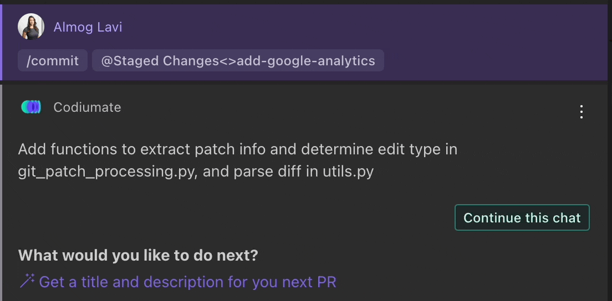

# `/commit`

<h2>Description</h2>
The `/commit` command streamlines the process of crafting commit messages for your staged changes. Available in Workspace Mode, this command analyzes your staged changes and generates a comprehensive commit message that succinctly describes all modifications. For added convenience, Codiumate integrates an "Auto commit message" button within the source control panel of the IDE, offering an alternative method to directly apply the generated message to the commit field.

<h2>How to Use</h2>
To utilize the `/commit` command effectively, follow these steps:

1. **Select Workspace Mode**: The `/commit` command operates in Workspace Mode, catering to changes made across multiple files within your project's workspace.

2. **Ensure Changes are Staged**: Before initiating the command, confirm that all changes you wish to include in your commit message are correctly staged.

3. **Initiate the Command**: Type `/commit` in the chat interface. Codiumate will analyze the staged changes and generate a detailed commit message reflecting the modifications.

4. **Copy and Paste the Commit Message**: Review the generated commit message provided by Codiumate. You can copy this message and manually paste it into the commit message field in your source control panel.

    Alternatively, use the **Auto commit message** button directly in the source control panel of your IDE. This button performs the same action, automatically inserting the generated commit message into the commit field, streamlining the process.

!!! success "Available in"
    - [Workspace Mode](../modes/workspace-mode.md)

!!! threads "Threads"
    This command supports threading. [Read more about Threads](../threads.md).

!!! example "Commit message using Chat"
    {width=700, loading=lazy}

    ---
    - **User**: Chooses Staged Changes mode
    - **Command**: `/commit`

!!! example "Commit message from Source Control panel"

    === "VSCode :simple-visualstudiocode:"
        {width=700, loading=lazy}
        
    === "JetBrains :simple-jetbrains:"
        {width=700, loading=lazy}
    
    ---
    - **User**: Clicks on Auto Commit Message in Source Control panel

        