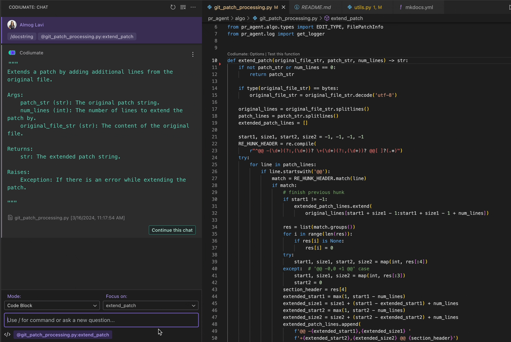
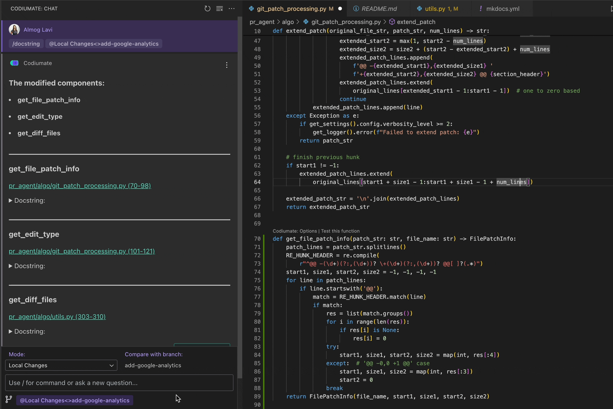

# `/docstring`

<h2>Description</h2>
Automatically generate or improve docstrings for your code, enhancing documentation quality and maintainability. The `/docstring` command is designed to aid in creating comprehensive, clear, and consistent docstrings for functions, classes, and modules, following best documentation practices.

<h2>How to Use</h2>
To use the `/docstring` command, follow these steps:

1. **Select Your Mode**: Choose the appropriate context for adding or improving docstrings. Codiumate supports this command in two modes:
    - **File Mode**: For generating or refining docstrings within a specific file, focusing on individual functions, classes, or entire files.
    - **Workspace Mode**: For a broader approach, encompassing multiple files within your workspace to ensure consistent documentation across your project.

2. **Select Your Focus**: Identify the code segment or entire file for which you wish to generate or enhance the docstring. 

3. **Initiate the Command**: Type `/docstring` followed by an optional specific instruction or leave it blank for general docstring generation. Codiumate will analyze the selected code and generate a suitable docstring or suggest improvements to existing documentation.

4. **Review and Apply**: Evaluate the suggested docstring provided by Codiumate. You can directly apply the changes with a single click or edit the suggestion to better fit your requirements before applying.

!!! note "Available in"
    - [File Mode](../modes/file-mode.md)
    - [Workspace Mode](../modes/workspace-mode.md)

!!! tip "Threads"
    This command supports threading. [Read more about Threads](../threads.md).

!!! example "Docsctring for component (File Mode)"
    <kbd>{width=700, loading=lazy}</kbd>
    
    ---
    - **User**: Selects a function that currently lacks a docstring.
    - **Command**: `/docstring`

!!! example "Docstring for Changeset (Workspace Mode)"
    <kbd>{width=700, loading=lazy}</kbd>

    ---
    - **User**: Chooses to improve docstrings across multiple files within the changeset.
    - **Command**: `/docstring enhance readability`