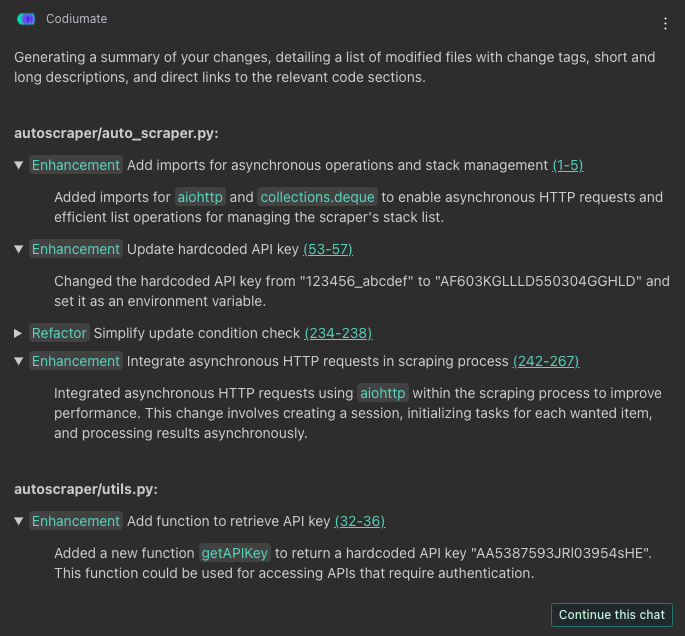

# `/recap`

##Description
The `/recap` command in Qodo Gen is designed for developers seeking a comprehensive overview of modifications within a selected changeset, be it file, local, staged, or committed changes. This command meticulously lists all changes, organizing them by modified file. Each change is annotated with a tag indicating the type of modification, a link to the affected code, and a detailed description of what was altered. This command is invaluable for code review, documentation, and ensuring a clear understanding of the work done or the changes made before moving forward with commits, merges, or deployments.

##How to Use
To effectively utilize the `/recap` command, adhere to the following steps:

1. **Select Your Changeset**: Identify the scope of your recap by selecting file, local, staged, or committed changes. This focus directs Qodo Gen to compile a detailed account of modifications relevant to your current review or documentation needs.

2. **Select Target Branch (for committed changes)**: If your focus is on committed changes, you must select the target branch to which your current working branch will be compared. For local or staged changes, proceed directly to initiating the command as these do not require a target branch selection.

3. **Initiate the Command**: Type `/recap` into the chat interface. Qodo Gen will process the specified changeset and generate a structured list of all changes made, categorized by file.

4. **Review the Recap**: Each file listed in the recap will include:
    - **Type of Change**: The type of the modification (e.g., Enhancement, Refactor, Bug fix).
    - **Link to Code**: A direct link to the modified code, facilitating easy access and review.
    - **Description of Changes**: A clear, concise description of what was changed in the code, providing context and understanding at a glance.

!!! success "Available in"
    - [:fontawesome-solid-code-compare: Git-Diff focus](../focus/git-diff.md)

!!! threads "Threads"
    This command supports threading. [Read more about Threads](../threads.md).

!!! example
    ### Command: 
    `/recap`
    
    ---

    ### Response: 
    