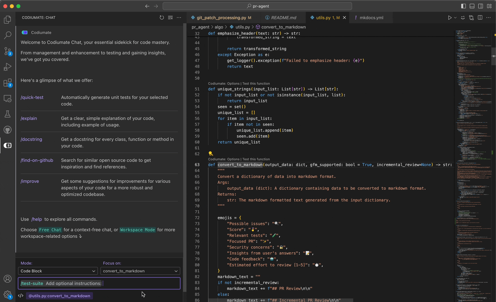

# `/test-suite`

<h2>Description</h2>
The `/test-suite` command streamlines the process of creating comprehensive test suites for your code. By simply selecting the code segment you wish to test, Codiumate automatically generates a robust test suite within its advanced panel. 

<h2>How to Use</h2>
Implementing the `/test-suite` command involves a few straightforward steps:

1. **Select File Mode**: The `/test-suite` command is designed to operate within File Mode, allowing you to generate test suites for specific code segments or entire files.

2. **Select Your Focus**: Choose the code for which you want to create a test suite. Precise selection ensures the generated tests are relevant and cover the selected code adequately.

3. **Initiate the Command**: Type `/test-suite` followed by any free text in the chat interface. This free text will be added to the general instructions field of the advanced panel, providing context or specific directions for the test suite generation. Upon execution, Codiumate opens the advanced panel where the test suite generation process takes place.

    Example: `/test-suite Use 'Given, When, Then' style`

    In this example, " Use 'Given, When, Then' style" is added to the general instructions field, guiding the generation of each test case in a specific style.

4. **Review and Customize the Test Suite**: The advanced panel will display the generated test suite, including your free text instructions. Here, you have the opportunity to review and adjust the test suite and instructions according to your project's specific needs.

**[Read more about Test Generation with Codiumate](../../tests/index.md)**

!!! note "Available in"
    - File Mode

!!! example "Example"
    - **User**: Chooses a code without tests
    - **Command**: `/test-suite`
    - **Codiumate Response**: 
    
        <kbd>{width=700, loading=lazy}</kbd>

!!! example "Example with General Instructions"
    - **User**: Chooses a code without tests
    - **Command**: `/test-suite use Arrange, Act, Assert style`
    - **Codiumate Response**: 
    
        <kbd>{width=700, loading=lazy}</kbd>

